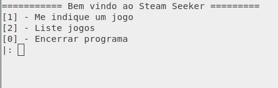
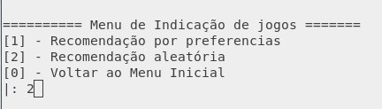
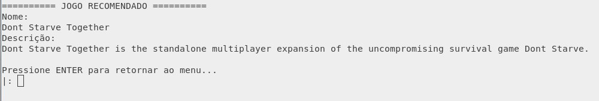

# NomeDoProjeto

**Disciplina**: FGA0210 - PARADIGMAS DE PROGRAMAÇÃO <br>
**Nro do Grupo**: 03<br>
**Paradigma**: Lógico<br>

## Alunos

| Matrícula  | Aluno                           |
| ---------- | ------------------------------- |
| 19/0063441 | Ana Carolina Carvalho da Silva  |
| 18/0113151 | Eduardo Nunes Picolo            |
| 18/0113861 | Kleidson Alves Corrêa           |
| 18/0125770 | Lucas Gabriel Bezerra           |
| 18/0114077 | Lucas Rodrigues Fonseca         |
| 18/0106970 | Matheus Gabriel Alves Rodrigues |
| 18/0129058 | Paulo Victor da Silva           |
| 18/0129287 | Pedro Henrique Vieira Lima      |
| 18/0130722 | Samuel Nogueira                 |

## Sobre 
A fim de ajudar milhares de jogadores ao redor do mundo, foi desenvolvido o Steam Seeker. O Steam Seeker é um sistema de recomendações de jogos que estão registrados na plataforma da Steam. O sistema faz não apenas recomendação, mas também organiza a listagem dos jogos.
Utilizando uma base de dados pública, é possível saber quais jogos o sistema deve recomendar. 

## Requisitos


| ID    | Requisito           | Descrição                                                                                                                                                                   |
| ----- | ------------------- | --------------------------------------------------------------------------------------------------------------------------------------------------------------------------- |
| RF001 | Recomendar por preferência | Baseado nas escolhas do usuário em Categoria, Gênero, Desenvolvedora, Editora recomendar um jogo |
| RF002 | Recomendar aleatoriamente    | Recomendar um jogo de forma aleatória sem preferências |
| RF003 | Listar por desenvolvedor | Listar os jogos organizando por desenvolvedor |
| RF004 | Listar todos os jogos      | Listar todos os jogos disponíveis |
| RF005 | Listar por gênero  | Listar os jogos organizando por gênero |

## Screenshots

Tela do menu principal da aplicação

 

Tela do menu de recomendação

 

Tela da recomendação

 

## Instalação 
**Linguagem**: Prolog <br>
**Tecnologia**: SWI-Prolog v7.6.4 <br>

Para rodar a aplicação é necessário instalar o SWI-Prolog.

## Uso 
No terminal:

``` shell
cd 2021.2_G3_Logico_Prologgames
```
```prolog
prolog
```
Dentro do console:
```prolog
[main, facts, menus, utils].
```
```prolog
start.
```

## Fontes
Fonte da base de dados utilizada
https://www.kaggle.com/nikdavis/steam-store-games
